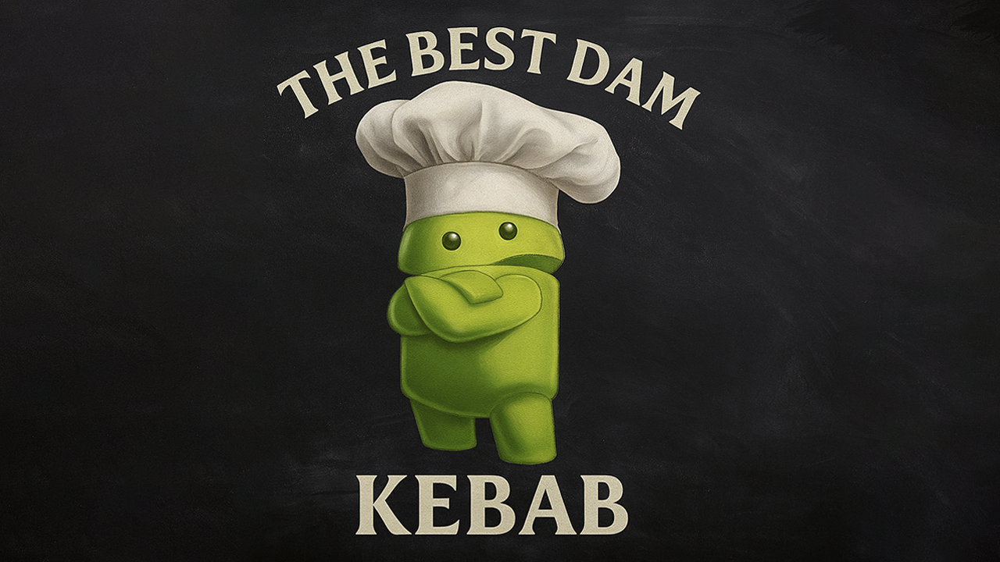
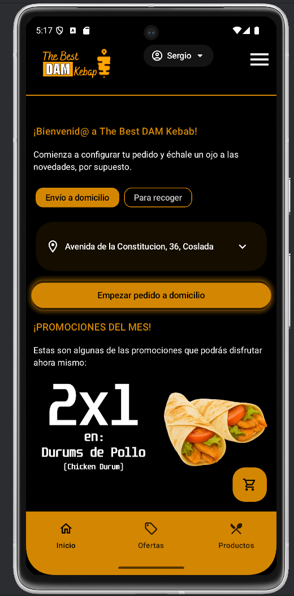
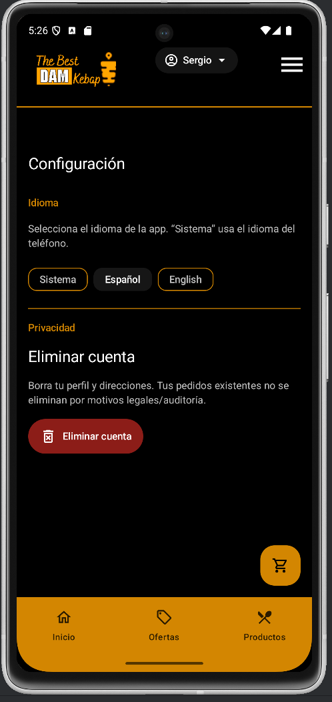
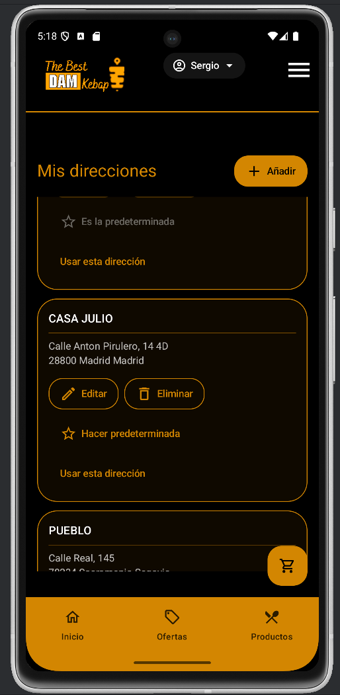
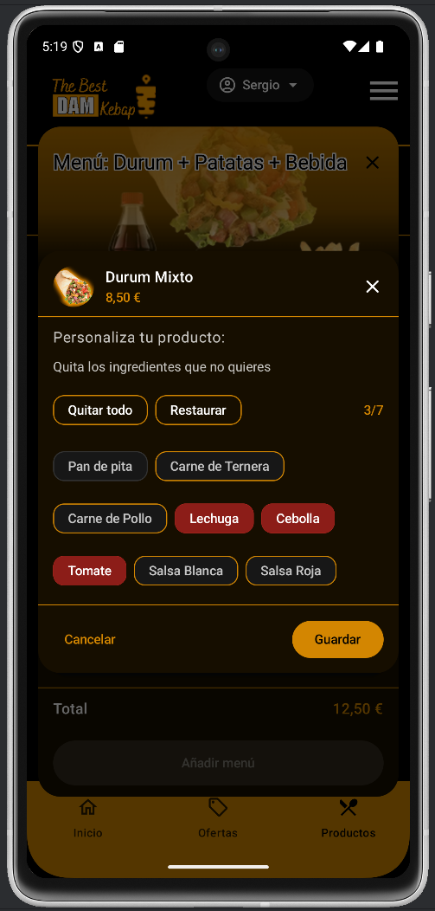
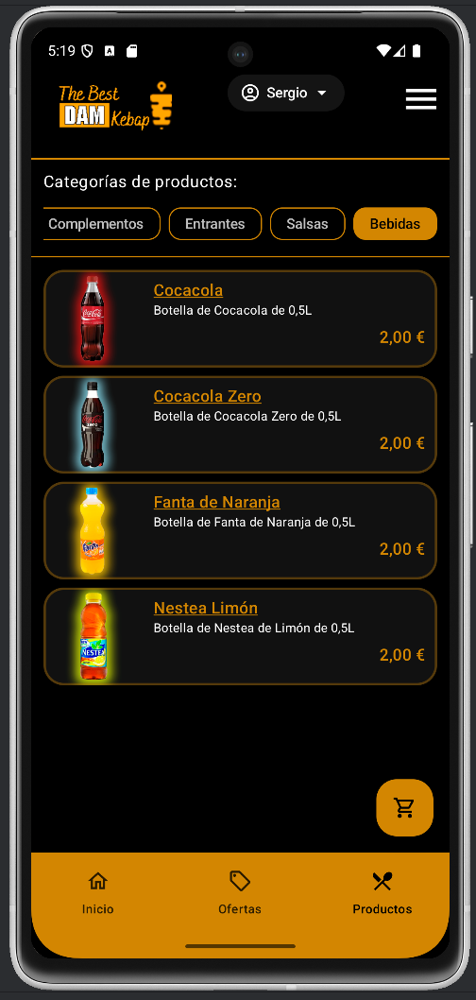
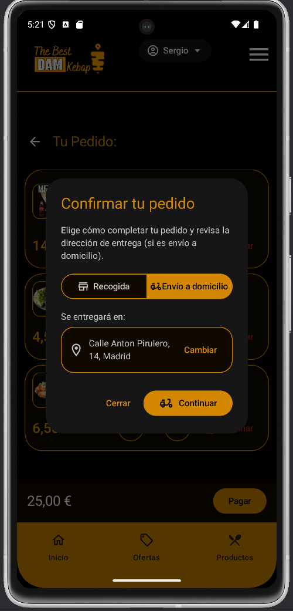
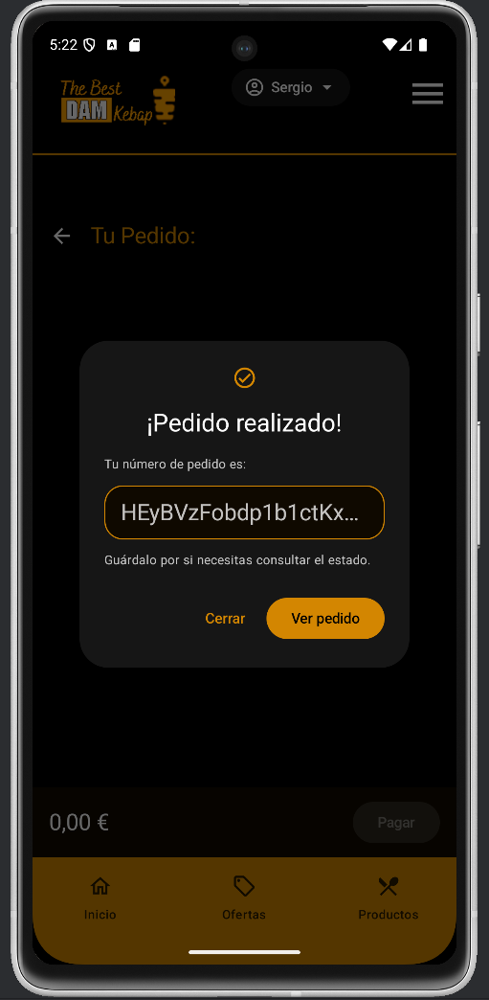

# The Best DAM Kebap (Android · Kotlin + Compose)

> **App demo de comida a domicilio para un negocio local.** Pensada para un restaurante de kebab (recogida o envío). Hecha con **Jetpack Compose**, **Material 3**, **Hilt**, **Firebase** y **DataStore**.  
> UI disponible en **Español** e **Inglés**, con cambio de idioma **en tiempo real**.  
> En el futuro, la parte de gestión del restaurante se desarrollará como SPA con **Angular**.

- El proyecto muestra **buenas prácticas** modernas de Android (Compose, M3, MVVM, Hilt, Firebase, Flows, DataStore).  
- Se prioriza **claridad del código**, **accesibilidad básica** y **estructura escalable**.  
- Se puede adaptar a otros negocios con imágenes verticales (p. ej., cafetería, pizzería) y **conectar un panel web** (Angular).
  
Puedes descargar la apk y probarla. Se encuentra disponible en mi portfolio: https://sergiomarchado.github.io/Portfolio-Sergio-Marchado-Angular/

---
<p align="center">
  
</p>

---

## 🎬 Demo en vídeo

[](https://www.youtube.com/shorts/-smwx-DZYlQ)

---

## Índice

- [📷 Capturas de pantalla](#-capturas-de-pantalla)
- [¿Qué es esta app? (explicación sencilla)](#qué-es-esta-app-explicación-sencilla)
- [Características](#características)
- [Cómo se usa (flujo básico)](#cómo-se-usa-flujo-básico)
- [Pila tecnológica y versiones](#pila-tecnológica-y-versiones)
- [Arquitectura y flujo de datos](#arquitectura-y-flujo-de-datos)
- [Estructura del proyecto](#estructura-del-proyecto)
- [Internacionalización (i18n)](#internacionalización-i18n)
- [Tema de marca (oscuro en ambos modos)](#tema-de-marca-oscuro-en-ambos-modos)
- [Configuración de Firebase](#configuración-de-firebase)
- [Desarrollo local](#desarrollo-local)
- [Problemas conocidos](#problemas-conocidos)
- [Hoja de ruta](#hoja-de-ruta)
- [Licencia](#licencia)
- [Notas para reclutadores](#notas-para-reclutadores)

---

## 📷 Capturas de pantalla

> Coloca las imágenes en `screenshots/` con **estos nombres**. Si falta alguna, simplemente no se mostrará.

<p align="center">
  
  
  
</p>
<p align="center">
  
  
  
</p>
<p align="center">
  
  
</p>

---


---

## ¿Qué es esta app?
> The Best DAM Kebab es una app que pretende demostrar cómo negocios locales de comida a domicilio pueden acceder a soluciones nativas en Android.  
- Puedes acceder como invitado o como usario registrado, donde se pueden ofrecer mejoras vía marketing.
- Al comenzar, eliges si quieres **recogida en local** o **envío a domicilio**.  
- Los **menús** se pueden **personalizar** (quitar ingredientes suele ser una exigencia y la mayoría de apps de comida a domicilio no tienen bien desarrollada esa parte).  
- El **pago es simulado**, así que puedes probar la experiencia completa sin cargo real.  
- La app está en **español** e **inglés** y puedes **cambiar el idioma al instante** desde Ajustes.

Puedes descargar la apk y probarla. Se encuentra disponible en mi portfolio: https://sergiomarchado.github.io/Portfolio-Sergio-Marchado-Angular/
---

## Características

- **Shell Home** con *drawer*, *top bar* de altura fija y *bottom nav* (Inicio / Ofertas / Productos).
- **Modo invitado** y **autenticación email/contraseña**; aviso al pasar de invitado a cuenta.
- **Order gate** inicial: **A domicilio** / **Para recoger** con selección/gestión de direcciones.
- **Productos y menús** con **personalización** (quitar ingredientes), *menu builder* por grupos y **precio por modo**.
- **Carrito** con stepper, resumen “Sin …” y diálogo de **confirmación de envío/recogida**.
- **Pago simulado** (sin cargo real) para pruebas.
- **Pedidos** con detalle legible y **repetir pedido**.
- **Ajustes**: cambio de **idioma** en runtime (es/en) + **borrar cuenta** con reautenticación.
- Imágenes desde **Firebase Storage** (Coil) y **App Check** (Debug / Play Integrity).

---

## Cómo se usa (flujo básico)

1. Abre la app y elige **A domicilio** o **Para recoger**.  
   - Si eliges a domicilio, añade o elige una **dirección**.
2. Explora **Productos** y **Menús** (cada menú tiene grupos: principal, acompañamiento, bebida).
3. Personaliza si lo deseas (**“sin”** ingredientes).
4. Añade al **carrito** y pulsa **Pagar** (pago simulado).
5. Revisa el pedido en **Pedidos** y usa **“Repetir pedido”** para ahorrar tiempo.
6. En **Ajustes**, cambia el **idioma** (se aplica al instante) o elimina tu cuenta.

---

## Stack tecnológico y versiones

- **Kotlin** 2.2.10 · **AGP** 8.12.1 (JDK 17)  
- **Compose** BOM `2025.08.00` (Material3, Foundation, Icons)  
- **Activity Compose** 1.10.1 · **Navigation Compose** 2.9.3  
- **Lifecycle** 2.9.2 (runtime + compose)  
- **Hilt** 2.57.1 (+ `hilt-navigation-compose` 1.2.0)  
- **DataStore** 1.1.7  
- **Coroutines** 1.10.2  
- **Firebase BOM** 34.1.0: Auth, Firestore, Storage, Analytics, App Check  
- **Coil** 2.6.0 (+ GIF)

> La referencia canónica está en `gradle/libs.versions.toml`.

---

## Arquitectura y flujo de datos

**Para quien empieza (resumen):**
- La app usa **MVVM**:  
  - **View** (Compose) dibuja la pantalla.  
  - **ViewModel** prepara los datos y el estado.  
  - **Repository** habla con **Firebase** / **DataStore**.
- El estado es **reactivo** (con `StateFlow`): cuando cambian los datos, la UI se actualiza sola.
- Para mensajes puntuales (snackbars, navegación), se usan **eventos** (`SharedFlow`).

**Detalles técnicos:**
- **UI (Compose)** en `view/...` con componentes y pantallas.  
- **ViewModel** en `viewmodel/...` con `StateFlow` (estado) y `SharedFlow` (eventos efímeros).  
- **Dominio** (`domain/...`) define contratos (repositorios e interfaces).  
- **Datos** (`data/`) implementa repositorios con Firebase y DataStore.  
- **DI** con **Hilt** (módulos en `di/`).  

**Flujos clave:**
- **Auth** → `AuthRepository.currentUser` (incluye invitados). `AuthEvent` informa de errores/info.  
- **Order gate** → `OrderGateViewModel` mantiene `mode/addressId/browsingOnly`.  
- **Carrito/Checkout** → `CartViewModel` emite Success/Error; la UI exige modo y dirección válidos.  
- **Pedidos** → `OrdersViewModel` + `buildFriendlyDetails(...)` para líneas legibles (con etiquetas localizadas).  
- **Ajustes/Idioma** → `AppSettingsRepository` (DataStore) + `LocaleManager.apply(tag)` + `SettingsViewModel.Event.RequestRecreate` → `SettingsScreen` llama `activity?.recreate()` para refresco inmediato.

---

## Estructura del proyecto

```
app/
├─ core/
│  ├─ imageloading/         # Utilidades Coil + cache URLs Storage
│  └─ localemanager/        # Cambio de idioma (AppCompat locales)
├─ data/
│  └─ settings/             # DataStore: idioma
├─ di/                      # Módulos Hilt
├─ domain/                  # Interfaces de repositorios y modelos de dominio
├─ navigation/              # NavHost y rutas
├─ ui/theme/                # Paleta y tema Material 3
├─ view/
│  ├─ auth/ cart/ home/ orders/ products/ settings/
└─ viewmodel/               # ViewModels + eventos/estado
```

---

## Internacionalización (i18n)

- Idiomas: **es** / **en**.  
- **Cambio en caliente** desde Ajustes con `AppCompatDelegate.setApplicationLocales(...)`.  
- Persistencia en **DataStore** (`AppSettingsRepository.languageTag`).  
- Aplicación en arranque (`TheBestDamKebapApp.onCreate`).  
- **Refresco inmediato**: `SettingsViewModel` emite `RequestRecreate` y la `SettingsScreen` recrea la Activity con `LocalActivity.current?.recreate()`.

Requisitos:
- `res/xml/locales_config.xml` con `<locale android:name="es"/>` y `<locale android:name="en"/>`.  
- En `AndroidManifest.xml`, dentro de `<application>`:
  ```xml
  android:localeConfig="@xml/locales_config"
  ```

---

## Configuración de Firebase (OBLIGATORIO)

1. Crea el proyecto y añade la app Android (package id del módulo `app`).  
2. Añade `app/google-services.json`.  
3. Habilita:
   - **Auth**: *Email/Password* + *Anonymous*.  
   - **Firestore** y **Storage**.  
   - **App Check**:
     - **Debug** → Debug provider (tokens de desarrollo).  
     - **Release** → Play Integrity.
4. Revisa las **reglas** de Firestore y Storage según tu entorno.  
5. Las imágenes se cargan desde **Firebase Storage** (Coil).

---

## Desarrollo local

**Requisitos**: Android Studio (Koala o superior), **JDK 17**.

**Pasos rápidos**
1. Clona el repo y sincroniza Gradle.  
2. Coloca `google-services.json` en `app/`.  
3. Ejecuta en emulador/dispositivo.  
4. Prueba **Ajustes → Idioma** (el cambio se aplica al instante).

**Build variants**: `debug` / `release`.  
App Check cambia de proveedor automáticamente según si la app es *debuggable*.

---

## Hoja de ruta

- SPA con **Angular** para la parte de gestión del restaurante (backoffice).  
- Detalle de pedido con **tracking** y **push notifications** para estado.  
- **Tests de UI**: gate, carrito, checkout e i18n.  

---

# Licencia de Uso para Portafolio — No Comercial v1.0

**Copyright © 2025 Sergio M.**  
Todos los derechos reservados, salvo lo permitido a continuación.

## 1. Permisos limitados
Se concede permiso gratuito, no exclusivo y revocable para:
- **Ver, clonar y ejecutar** este proyecto **con fines personales, académicos o de evaluación** (p. ej., procesos de selección).
- Crear **modificaciones privadas** para esos mismos fines.

## 2. Restricciones
No está permitido, salvo autorización previa y por escrito del titular:
- **Uso comercial** de cualquier tipo (venta, servicios, SaaS, consultoría, monetización directa o indirecta).
- **Redistribuir, publicar o sublicenciar** el código o sus derivados (incluye subirlo a repositorios públicos).
- **Integrarlo en productos** o proyectos que se distribuyan a terceros.
- **Eliminar avisos** de copyright o de licencia.
- **Usar el código/recursos** (incluyendo capturas y marcas) para **entrenar modelos de IA** o datasets.
- **Usar marcas y assets** de terceros más allá de lo permitido por sus licencias.

## 3. Terceras partes
Este proyecto puede incluir dependencias y recursos de terceros que se rigen por sus **propias licencias**. Dichas licencias **prevalecen** sobre este documento en lo que corresponda.

## 4. Atribución
En demos o presentaciones públicas, se solicita **mencionar** “The Best DAM Kebap (Android)” y al autor.

## 5. Terminación
Este permiso se **anula automáticamente** si se incumple cualquiera de los puntos anteriores. El titular puede revocarlo en cualquier momento.

## 6. Garantía y responsabilidad
El software se proporciona **“TAL CUAL”**, sin garantías de ningún tipo. El autor **no será responsable** de ningún daño derivado del uso del software.

## 7. Contacto para licencias comerciales
Si quieres usar este proyecto **más allá** de lo permitido (p. ej., en producción o con fines comerciales), **contacta** para acordar una licencia comercial:
- Email: **sergio.marchadoropero3@gmail.com**
- LinkedIn: **[Este es mi perfil](https://www.linkedin.com/in/sergio-marchado-ropero-82b8b914b/)**

---

